```mermaid
erDiagram
    members {
      integer id PK
      integer avatar
      varchar email
      varchar phone_number
      integer gender
      timestamp day_of_birth
      text token
      varchar name
      text password
      integer status
      jsonb first_login
      timestamp created_at
      timestamp updated_at
      jsonb meta
    }
    roles {
      integer id PK
      varchar name
      integer status
      text description
      timestamp created_at
      timestamp updated_at
      jsonb meta
    }

    users {
      integer id PK
      integer avatar
      varchar email
      varchar phone_number
      integer gender
      timestamp day_of_birth
      text token
      varchar name
      text password
      integer status
      integer id_role FK
      text firebase_token
      jsonb first_login
      timestamp created_at
      timestamp updated_at
      jsonb meta
    }

    third_party_logs {
      integer id PK
      integer type
      integer status
      integer member_id FK
      timestamp created_at
      timestamp updated_at
      jsonb meta
    }

    rbac_modules {
      integer id PK
      varchar name
      varchar key
      text description
      timestamp created_at
      timestamp updated_at
      jsonb meta
    }

    rbac_actions {
        integer id PK
        varchar name
        varchar key
        integer rbac_module_id FK
        integer status
        text description
        timestamp created_at
        timestamp updated_at
        jsonb meta
    }

    role_actions {
        integer id PK
        integer rbac_action_id FK
        integer role_id FK
        integer status
        timestamp created_at
        timestamp updated_at
        jsonb meta
    }

    mediafile {
      integer id PK
      integer member_id FK
      text file_path
      integer status
      integer type
      timestamp created_at
      timestamp updated_at
      jsonb meta
    }

    otps {
      integer id PK
      varchar phone_number
      varchar code
      jsonb token
      integer status
      integer type
      varchar ip
      timestamp created_at
      timestamp updated_at
      jsonb meta
    }

    products {
      integer id PK
      varchar name
      text description
      numeric price
      varchar sku
      integer stock_quantity
      integer status
      timestamp created_at
      timestamp updated_at
      jsonb meta
    }
    inventory {
      integer id PK
      integer product_id FK
      integer quantity
      varchar adjustment_type
      timestamp created_at
      timestamp updated_at
      jsonb meta
    }

    orders {
      integer id PK
      integer member_id FK
      numeric total_amount
      integer status
      timestamp created_at
      timestamp updated_at
      jsonb meta
    }

    order_items {
      integer id PK
      integer order_id FK
      integer product_id FK
      integer quantity
      numeric price
      timestamp created_at
      timestamp updated_at
      jsonb meta
    }

    payments {
      integer id PK
      integer order_id FK
      varchar payment_method
      numeric amount
      integer status
      timestamp created_at
      timestamp updated_at
      jsonb meta
    }
    discounts {
      integer id PK
      varchar code
      text description
      numeric discount_percentage
      timestamp start_date
      timestamp end_date
      integer status
      timestamp created_at
      timestamp updated_at
      jsonb meta
    }

    employees {
      integer id PK
      varchar name
      varchar email
      varchar phone_number
      integer role_id FK
      integer status
      timestamp created_at
      timestamp updated_at
      jsonb meta
    }

    taxes {
      integer id PK
      varchar name
      numeric rate
      text description
      integer status
      timestamp created_at
      timestamp updated_at
      jsonb meta
    }
    product_taxes {
      integer id PK
      integer product_id FK
      integer tax_id FK
      timestamp created_at
      timestamp updated_at
      jsonb meta
    }

    shifts {
      integer id PK
      integer employee_id FK
      timestamp start_time
      timestamp end_time
      timestamp created_at
      timestamp updated_at
      jsonb meta
    }

    coupons {
      integer id PK
      varchar code
      text description
      numeric discount_amount
      numeric discount_percentage
      integer max_usage
      integer used_count
      timestamp start_date
      timestamp end_date
      integer status
      timestamp created_at
      timestamp updated_at
      jsonb meta
    }
    loyalty_transactions {
      integer id PK
      integer member_id FK
      integer order_id FK
      integer points_earned
      integer points_spent
      varchar transaction_type
      timestamp created_at
      timestamp updated_at
    }

    loyalty_points {
      integer id PK
      integer member_id FK
      integer points
      integer lifetime_points
      timestamp created_at
      timestamp updated_at
    }

    suppliers {
      integer id PK
      varchar name
      varchar contact_person
      varchar email
      varchar phone
      text address
      integer status
      timestamp created_at
      timestamp updated_at
      jsonb meta
    }

    purchase_orders {
      integer id PK
      integer supplier_id FK
      numeric total_amount
      integer status
      integer created_by FK
      timestamp created_at
      timestamp updated_at
      jsonb meta
    }

    purchase_order_items {
      integer id PK
      integer purchase_order_id FK
      integer product_id FK
      integer quantity
      numeric unit_price
      timestamp created_at
      timestamp updated_at
    }
    
    tags {
      integer id PK
      varchar name
      integer status
      timestamp created_at
      timestamp updated_at
    }

    product_tags {
      integer id PK
      integer product_id FK
      integer tag_id FK
      timestamp created_at
      timestamp updated_at
    }
    returns {
      integer id PK
      integer order_id FK
      integer member_id FK
      text return_reason
      integer status
      numeric refund_amount
      integer processed_by FK
      timestamp created_at
      timestamp updated_at
      jsonb meta
    }

    return_items {
      integer id PK
      integer return_id FK
      integer order_item_id FK
      integer quantity
      text reason
      timestamp created_at
      timestamp updated_at
    }
    product_categories {
      integer id PK
      integer parent_id FK
      varchar name
      text description
      integer status
      timestamp created_at
      timestamp updated_at
      jsonb meta
    }

    product_categories_mapping {
      integer id PK
      integer product_id FK
      integer category_id FK
      timestamp created_at
      timestamp updated_at
    }
    product_attributes {
      integer id PK
      varchar name
      integer status
      timestamp created_at
      timestamp updated_at
    }

    product_attribute_values {
      integer id PK
      integer product_id FK
      integer attribute_id FK
      text value
      timestamp created_at
      timestamp updated_at
    }

    product_variants {
      integer id PK
      integer product_id FK
      varchar sku
      numeric price
      integer stock_quantity
      integer status
      timestamp created_at
      timestamp updated_at
      jsonb meta
    }

    variant_attributes {
      integer id PK
      integer variant_id FK
      integer attribute_id FK
      text value
      timestamp created_at
      timestamp updated_at
    }

    %% Relationships
    members ||--|{ third_party_logs : "member_id"
    members ||--|{ mediafile : "member_id"
    members ||--|{ loyalty_points : "member_id"
    members ||--|{ loyalty_transactions : "member_id"
    roles ||--|{ users : "id_role"
    roles ||--|{ employees : "role_id"
    rbac_modules ||--|{ rbac_actions : "rbac_module_id"
    roles ||--|{ role_actions : "role_id"
    rbac_actions ||--|{ role_actions : "rbac_action_id"
    products ||--|{ product_taxes : "product_id"
    taxes ||--|{ product_taxes : "tax_id"
    products ||--|{ inventory : "product_id"
    orders ||--|{ order_items : "order_id"
    products ||--|{ order_items : "product_id"
    orders ||--|{ payments : "order_id"
    members ||--|{ orders : "member_id"
    products ||--|{ product_categories_mapping : "product_id"
    product_categories ||--|{ product_categories_mapping : "category_id"
    products ||--|{ product_tags : "product_id"
    tags ||--|{ product_tags : "tag_id"
    employees ||--|{ shifts : "employee_id"
    users ||--|{ purchase_orders : "created_by"
    suppliers ||--|{ purchase_orders : "supplier_id"
    purchase_orders ||--|{ purchase_order_items : "purchase_order_id"
    products ||--|{ purchase_order_items : "product_id"
    orders ||--|{ returns : "order_id"
    members ||--|{ returns : "member_id"
    returns ||--|{ return_items : "return_id"
    order_items ||--|{ return_items : "order_item_id"
    products ||--|{ product_attribute_values : "product_id"
    product_attributes ||--|{ product_attribute_values : "attribute_id"
    products ||--|{ product_variants : "product_id"
    product_variants ||--|{ variant_attributes : "variant_id"
    product_attributes ||--|{ variant_attributes : "attribute_id"
```

### Mô tả
#### 1. **members**
- Lưu thông tin người dùng cuối (end-user).
- Các trường quan trọng:
  - **avatar**: ID của ảnh đại diện.
  - **gender**, **day_of_birth**, **phone_number**: Thông tin cá nhân cơ bản.
  - **token**: Chuỗi token dành cho các phiên đăng nhập.
  - **meta**: Dữ liệu bổ sung dưới dạng JSON.

#### 2. **users**
- Lưu thông tin quản trị viên.
- Trường **id_role** là khóa ngoại liên kết với bảng **roles** để xác định quyền của người dùng.

#### 3. **roles**
- Định nghĩa quyền hệ thống.
- Các quyền được gán trực tiếp cho **users** hoặc **employees** thông qua **role_actions**.

#### 4. **rbac_modules**, **rbac_actions**, **role_actions**
- **rbac_modules**: Chứa thông tin về các mô-đun trong hệ thống.
- **rbac_actions**: Định nghĩa các hành động cụ thể trong từng mô-đun.
- **role_actions**: Nối vai trò (roles) với các hành động được phép.

#### 5. **products**, **inventory**, **orders**, **order_items**
- **products**: Lưu thông tin sản phẩm, giá, tồn kho.
- **inventory**: Quản lý số lượng sản phẩm trong kho và các điều chỉnh.
- **orders**: Thông tin các đơn đặt hàng.
- **order_items**: Liệt kê các sản phẩm trong từng đơn hàng.

#### 6. **discounts**, **coupons**
- **discounts**: Các mã giảm giá dựa trên phần trăm.
- **coupons**: Các CTUD cụ thể.

#### 7. **employees**, **shifts**
- **employees**: Thông tin nhân viên, gắn liền với vai trò.
- **shifts**: Quản lý ca làm việc của từng nhân viên.

#### 8. **loyalty_points**, **loyalty_transactions**
- **loyalty_points**: Điểm tích lũy của thành viên.
- **loyalty_transactions**: Lịch sử giao dịch liên quan đến điểm thưởng.

#### 9. **suppliers**, **purchase_orders**
- **suppliers**: Thông tin nhà cung cấp.
- **purchase_orders**: Quản lý phiếu mua hàng từ nhà cung cấp.

#### 10. **tags**, **product_tags**
- **tags**: Định nghĩa nhãn cho sản phẩm.
- **product_tags**: Liên kết sản phẩm với các nhãn.

#### 11. **returns**, **return_items**
- **returns**: Quản lý thông tin trả hàng, hoàn tiền.
- **return_items**: Chi tiết các sản phẩm được trả lại.

#### 12. **product_categories**, **product_categories_mapping**
- **product_categories**: Quản lý danh mục sản phẩm.
- **product_categories_mapping**: Gắn sản phẩm với danh mục.

#### 13. **product_attributes**, **product_attribute_values**
- **product_attributes**: Định nghĩa các thuộc tính của sản phẩm (ví dụ: màu sắc, kích thước).
- **product_attribute_values**: Giá trị thuộc tính của sản phẩm.

#### 14. **product_variants**, **variant_attributes**
- **product_variants**: Biến thể của sản phẩm (ví dụ: SKU riêng).
- **variant_attributes**: Giá trị thuộc tính cho từng biến thể.
