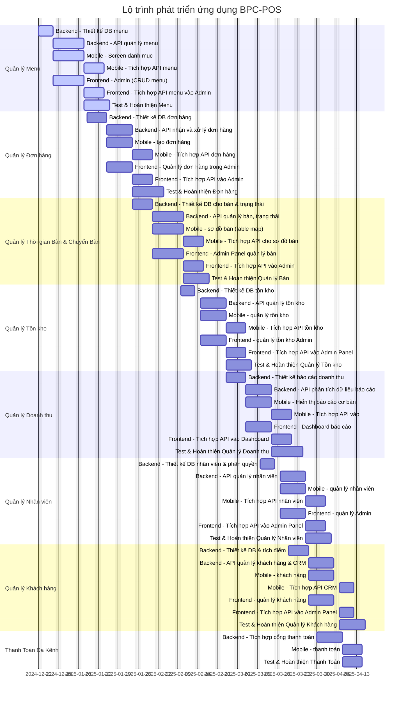

```mermaid
gantt
    title Lộ trình phát triển ứng dụng BPC-POS
    dateFormat  YYYY-MM-DD
    excludes    weekends

    section Quản lý Menu
    Backend - Thiết kế DB menu                   :active, a1, 2024-12-22, 5d
    Backend - API quản lý menu                   :active, a2, after a1, 7d
    Mobile - Screen danh mục                     :active, a3, after a1, 7d
    Mobile - Tích hợp API menu                   :active, a4, after a3, 5d
    Frontend - Admin (CRUD menu)                 :active, a5, after a1, 7d
    Frontend - Tích hợp API menu vào Admin       :active, a6, after a5, 5d
    Test & Hoàn thiện Menu                       :active, a7, after a2, 7d

    section Quản lý Đơn hàng
    Backend - Thiết kế DB đơn hàng               :b1, 2025-01-08, 5d
    Backend - API nhận và xử lý đơn hàng         :b2, after b1, 7d
    Mobile - tạo đơn hàng                        :b3, after b1, 7d
    Mobile - Tích hợp API đơn hàng               :b4, after b3, 5d
    Frontend - Quản lý đơn hàng trong Admin      :b5, after b1, 7d
    Frontend - Tích hợp API vào Admin            :b6, after b5, 5d
    Test & Hoàn thiện Đơn hàng                   :b7, after b2, 7d

    section Quản lý Thời gian Bàn & Chuyển Bàn
    Backend - Thiết kế DB cho bàn & trạng thái   :c1, 2025-01-24, 5d
    Backend - API quản lý bàn, trạng thái        :c2, after c1, 7d
    Mobile - sơ đồ bàn (table map)               :c3, after c1, 7d
    Mobile - Tích hợp API cho sơ đồ bàn          :c4, after c3, 5d
    Frontend - Admin Panel quản lý bàn           :c5, after c1, 7d
    Frontend - Tích hợp API vào Admin            :c6, after c5, 5d
    Test & Hoàn thiện Quản lý Bàn                :c7, after c2, 7d

    section Quản lý Tồn kho
    Backend - Thiết kế DB tồn kho                :d1, 2025-02-10, 5d
    Backend - API quản lý tồn kho                :d2, after d1, 7d
    Mobile - quản lý tồn kho                     :d3, after d1, 7d
    Mobile - Tích hợp API tồn kho                :d4, after d3, 5d
    Frontend - quản lý tồn kho Admin             :d5, after d1, 7d
    Frontend - Tích hợp API vào Admin Panel      :d6, after d5, 5d
    Test & Hoàn thiện Quản lý Tồn kho            :d7, after d2, 7d

    section Quản lý Doanh thu
    Backend - Thiết kế báo cáo doanh thu         :e1, 2025-02-26, 5d
    Backend - API phân tích dữ liệu báo cáo      :e2, after e1, 7d
    Mobile - Hiển thị báo cáo cơ bản             :e3, after e1, 7d
    Mobile - Tích hợp API vào                    :e4, after e3, 5d
    Frontend - Dashboard báo cáo                 :e5, after e1, 7d
    Frontend - Tích hợp API vào Dashboard        :e6, after e5, 5d
    Test & Hoàn thiện Quản lý Doanh thu          :e7, after e2, 7d

    section Quản lý Nhân viên
    Backend - Thiết kế DB nhân viên & phân quyền :f1, 2025-03-10, 5d
    Backend - API quản lý nhân viên              :f2, after f1, 7d
    Mobile - quản lý nhân viên                   :f3, after f1, 7d
    Mobile - Tích hợp API nhân viên              :f4, after f3, 5d
    Frontend - quản lý Admin                     :f5, after f1, 7d
    Frontend - Tích hợp API vào Admin Panel      :f6, after f5, 5d
    Test & Hoàn thiện Quản lý Nhân viên          :f7, after f2, 7d

    section Quản lý Khách hàng
    Backend - Thiết kế DB & tích điểm            :g1, 2025-03-20, 5d
    Backend - API quản lý khách hàng & CRM       :g2, after g1, 7d
    Mobile - khách hàng                          :g3, after g1, 7d
    Mobile - Tích hợp API CRM                    :g4, after g3, 5d
    Frontend - quản lý khách hàng                :g5, after g1, 7d
    Frontend - Tích hợp API vào Admin Panel      :g6, after g5, 5d
    Test & Hoàn thiện Quản lý Khách hàng         :g7, after g2, 7d

    section Thanh Toán Đa Kênh
    Backend - Tích hợp cổng thanh toán           :h1, 2025-03-30, 7d
    Mobile - thanh toán                          :h2, after h1, 5d
    Test & Hoàn thiện Thanh Toán                 :h3, after h1, 5d
```